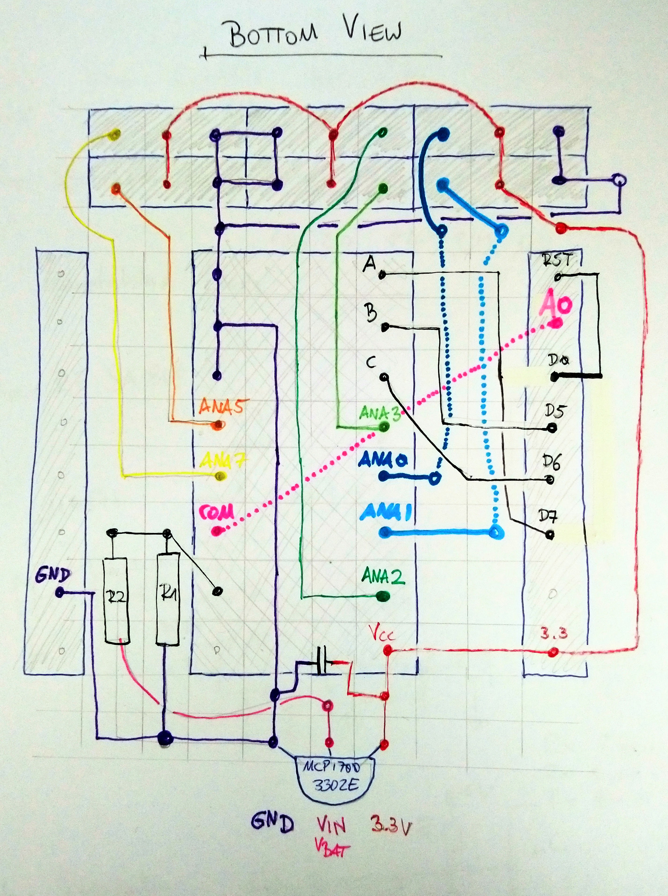

# sIoThy

Soil IoT Humidity Monitor

## ESP8266

## ADC-Mux Shield

Since the ESP8266 has only one analog input (`A0`), we have to use a analog signal multiplexer. For that we
use the [74HC4051D](https://www.mouser.com/datasheet/2/408/74HC4051D_datasheet_en_20201203-959201.pdf):

This is mounted on a customly designed shield, where the ESP socks into:

